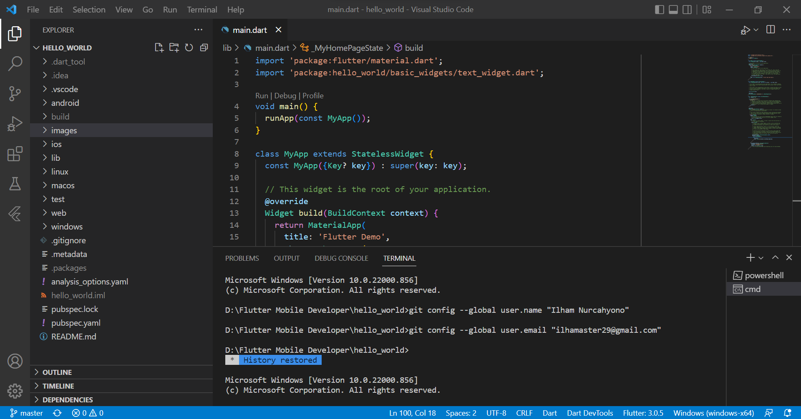
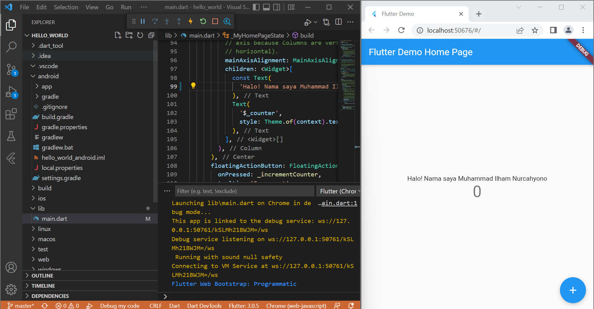
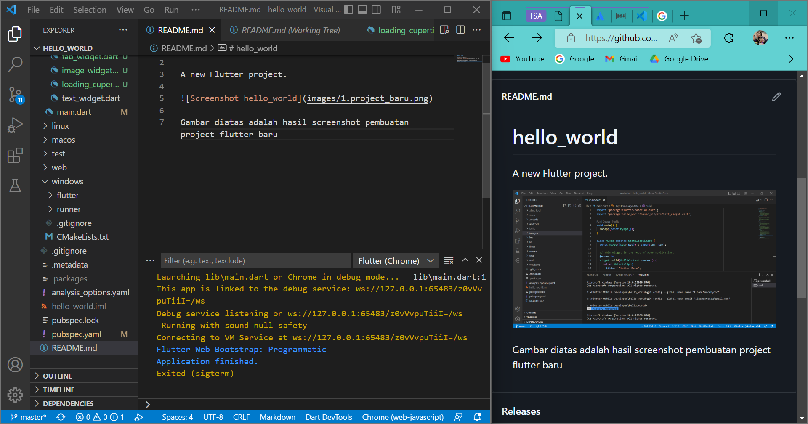
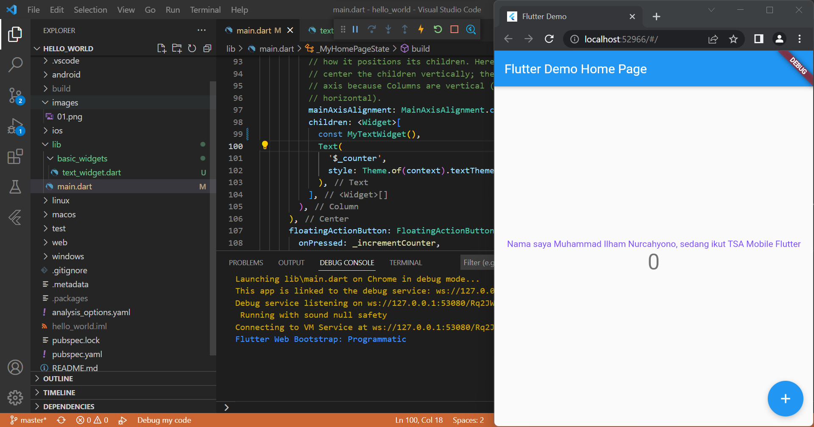
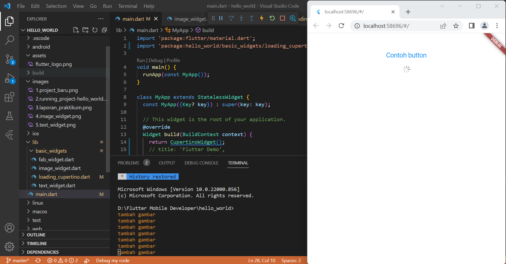

# hello_world

Laporan Praktikum

Gambar diatas adalah hasil screenshot pembuatan project flutter baru

Gambar diatas adalah tampilan hasil running project hello world untuk pertama kali menggunakan browser google chrome

Gambar diatas adalah tampilan hasil laporan sementara yang diedit pada file readme di aplikasi vscode

Gambar diatas adalah tampilan hasil penambahan image_widget.dart pada file main.dart

Gambar diatas adalah tampilan hasil penambahan text_widget.dart pada file main.dart

Gambar diatas adalah tampilan hasil running cupertino button dan loading bar