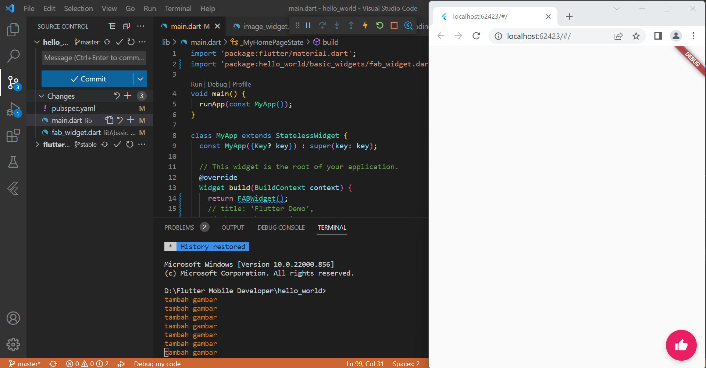
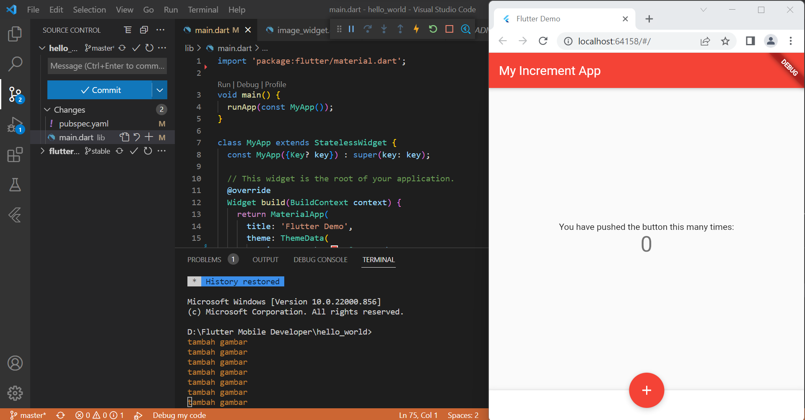
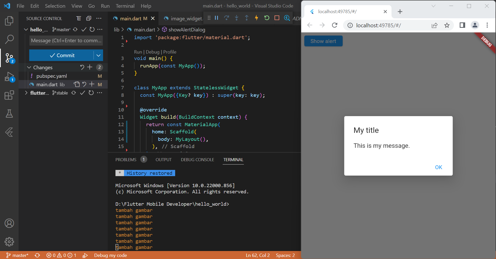

# **Laporan Praktikum**

## 1. Membuat Project Flutter Baru

Gambar diatas adalah hasil *screenshot* pembuatan *project* flutter baru.

## 2. Running Project hello_world

Gambar diatas adalah tampilan hasil *running project* hello_world untuk pertama kali menggunakan *browser* google chrome.

## 3. Penulisan Laporan Praktikum Pada File readme.md

Gambar diatas adalah tampilan hasil laporan sementara yang diedit pada file **README.md** di aplikasi vscode.

## 4. Menambahkan Image Widget

Gambar diatas adalah tampilan hasil penambahan **image_widget.dart** pada file **main.dart**

## 5. Menambahkan Text Widget

Gambar diatas adalah tampilan hasil penambahan **text_widget.dart** pada **file main.dart**

## 6. Menambahkan Cupertino Button dan Loading Bar

Gambar diatas adalah tampilan hasil *running* **cupertino button dan loading bar**.

## 7. Menambahkan Floating Action Button

Gambar diatas adalah tampilan hasil *running* **floating action button**.

## 8. Menambahkan Scaffold Widget

Gambar diatas adalah tampilan hasil *running* **scaffold widget**.

## 9. Menambahkan Dialog Widget

Gambar diatas adalah tampilan hasil *running* **dialog widget**. Ketika tombol *show alert* ditekan, maka akan muncul *dialog box* bertuliskan "*My title, This is my message.*"

## 10. Menambahkan Input dan Selecion Widget

Gambar diatas adalah tampilan hasil *running* **input dan selection widget**. Pada emulator (chrome), *field* "Nama" diisi sesuai *input* yang kita masukkan lewat keyboard. 