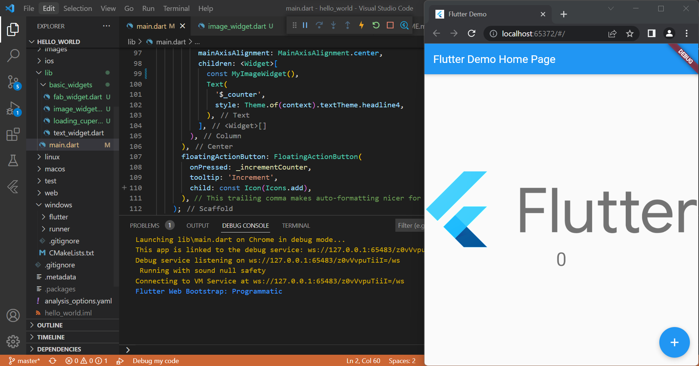

# **Laporan Praktikum**

## 1. Membuat Project Flutter Baru

Gambar diatas adalah hasil screenshot pembuatan project flutter baru.

## 2. Running Project hello_world

Gambar diatas adalah tampilan hasil running project hello world untuk pertama kali menggunakan browser google chrome

## 3. Penulisan Laporan Praktikum Pada File readme.md

Gambar diatas adalah tampilan hasil laporan sementara yang diedit pada file readme di aplikasi vscode

## 4. Menambahkan Image Widget

Gambar diatas adalah tampilan hasil penambahan image_widget.dart pada file main.dart

## 5. Menambahkan Text Widget

Gambar diatas adalah tampilan hasil penambahan text_widget.dart pada file main.dart

## 6. Menambahkan Cupertino Button dan Loading Bar

Gambar diatas adalah tampilan hasil running cupertino button dan loading bar

## 7. Menambahkan Floating Action Button

Gambar diatas adalah tampilan hasil running floating action button

## 8. Menambahkan Scaffold Widget

Gambar diatas adalah tampilan hasil running scaffold widget